# GitVault

**A sovereign password manager** — your vault lives in your own private GitHub repository, encrypted end-to-end on device with XChaCha20-Poly1305 before ever leaving your phone.

> No cloud subscriptions. No vendor lock-in. Just your data, your repository, your keys.

---

## Screenshots

<table>
  <tr>
    <td align="center">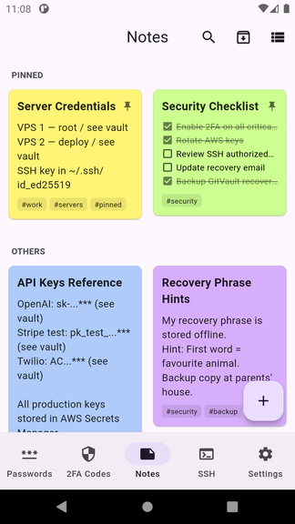<br/><sub><b>Notes · Grid View</b></sub></td>
    <td align="center">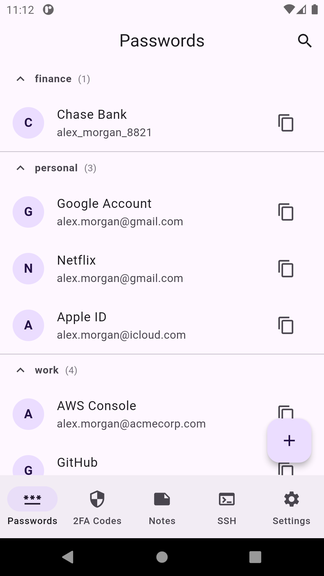<br/><sub><b>Passwords · Grouped List</b></sub></td>
    <td align="center">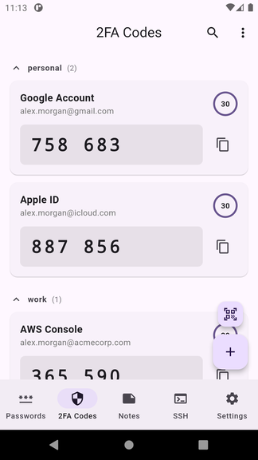<br/><sub><b>2FA Codes · Live TOTP</b></sub></td>
    <td align="center">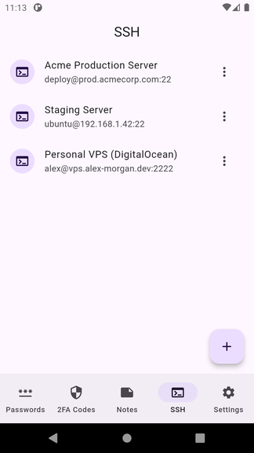<br/><sub><b>SSH · Credentials</b></sub></td>
    <td align="center">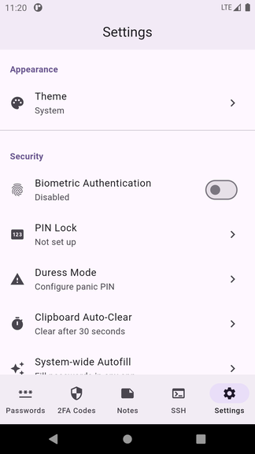<br/><sub><b>Settings</b></sub></td>
  </tr>
</table>

---

## Features

### 📝 Notes
<table>
  <tr>
    <td align="center"><br/><sub><b>Grid View · Pinned Notes</b></sub></td>
    <td align="center">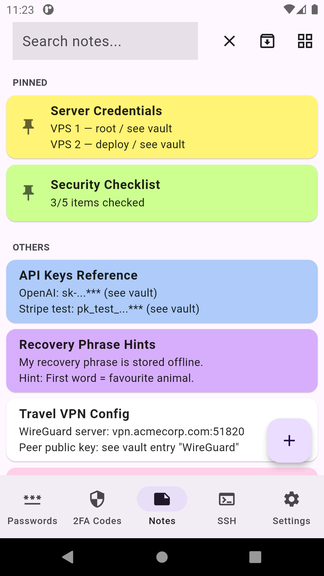<br/><sub><b>List View Toggle</b></sub></td>
    <td align="center">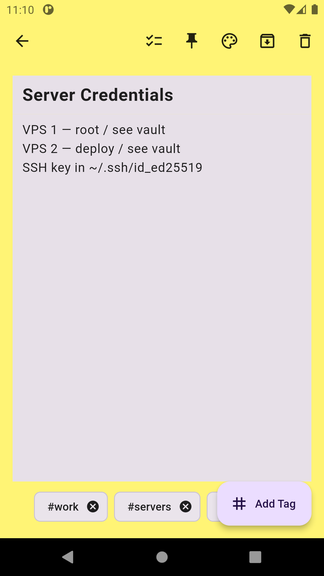<br/><sub><b>Note Editor</b></sub></td>
    <td align="center">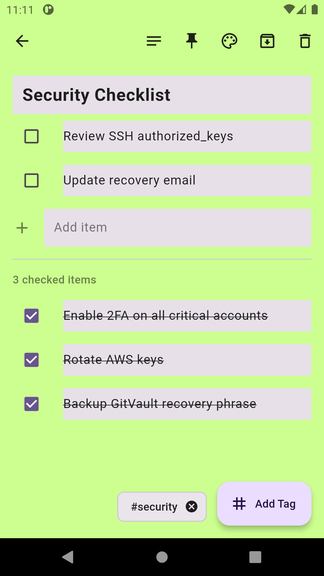<br/><sub><b>Checklist Notes</b></sub></td>
  </tr>
  <tr>
    <td align="center">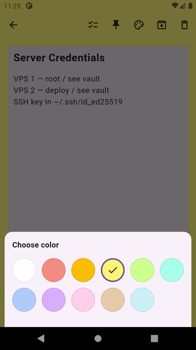<br/><sub><b>Color Picker (11 colors)</b></sub></td>
    <td align="center">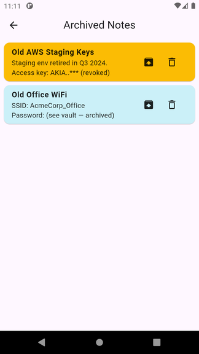<br/><sub><b>Archived Notes</b></sub></td>
    <td align="center">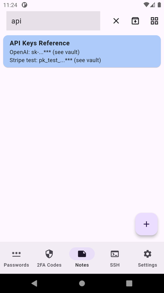<br/><sub><b>Notes Search</b></sub></td>
    <td></td>
  </tr>
</table>

- **Grid & List view** — toggle between masonry cards and compact list
- **Pin notes** — keep important notes always at the top
- **Checklist notes** — tap items to check off tasks
- **11 color themes** — white, red, orange, yellow, green, teal, blue, purple, pink, brown, gray
- **Tags** — organize with hashtags (#work, #api, etc.)
- **Archive** — hide notes without deleting them
- **Full-text search** — instantly filter notes by title or content

---

### 🔐 Passwords
<table>
  <tr>
    <td align="center"><br/><sub><b>Grouped by Category</b></sub></td>
    <td align="center">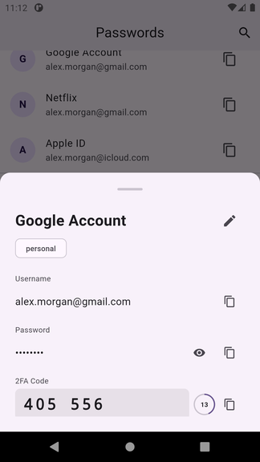<br/><sub><b>Detail + Live TOTP</b></sub></td>
    <td align="center">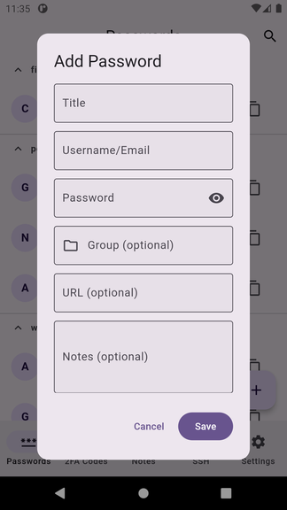<br/><sub><b>Add Password</b></sub></td>
    <td align="center">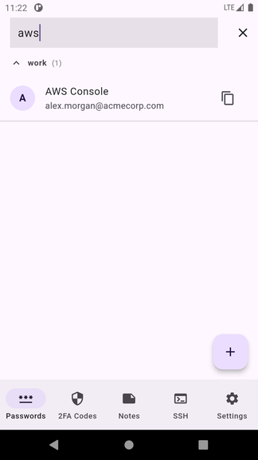<br/><sub><b>Password Search</b></sub></td>
  </tr>
</table>

- **Groups** — organize entries into finance, work, personal, or custom groups
- **Collapsible sections** — expand/collapse groups for quick navigation
- **One-tap copy** — copy username or password without opening the entry
- **URL & notes** — store website URL and free-form notes per entry
- **Live search** — filter across all groups instantly

---

### 🔑 2FA / TOTP Codes
<table>
  <tr>
    <td align="center"><br/><sub><b>Live TOTP Codes with Timer</b></sub></td>
    <td align="center"><br/><sub><b>TOTP in Password Detail</b></sub></td>
  </tr>
</table>

- **Built-in authenticator** — store TOTP secrets alongside passwords
- **Live codes** — 6-digit codes regenerate every 30 seconds
- **Countdown ring** — visual timer shows seconds until next code
- **Dedicated tab** — view all 2FA codes in one place
- **One-tap copy** — copy code before it expires

---

### 🖥️ SSH Terminal
<table>
  <tr>
    <td align="center"><br/><sub><b>SSH Credentials</b></sub></td>
    <td align="center">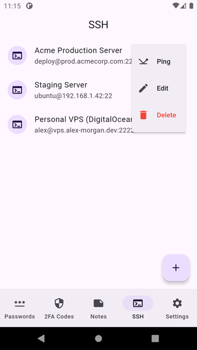<br/><sub><b>Quick Actions Menu</b></sub></td>
    <td align="center">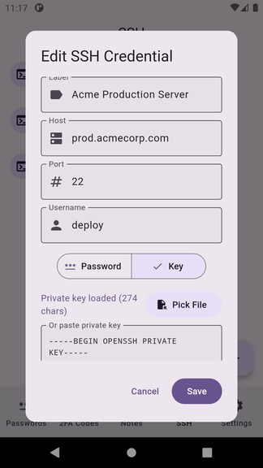<br/><sub><b>Edit Credential (Key Auth)</b></sub></td>
    <td align="center">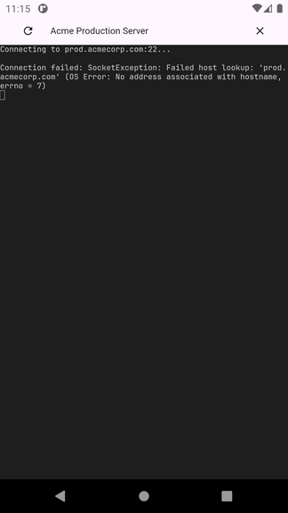<br/><sub><b>Terminal View</b></sub></td>
  </tr>
</table>

- **Password & key authentication** — supports both password and SSH private key auth
- **Custom ports** — connect to any port (not just 22)
- **Ping** — test reachability before connecting
- **Terminal emulator** — full interactive shell with gestures
- **Termux-like gestures** — pinch zoom, double-tap toolbar, long-press context menu
- **Volume key bindings** — Volume Down → Ctrl+C, Volume Up → Ctrl+D
- **Persistent sessions** — sessions survive app closure via background notification

---

### ⚙️ Settings
<table>
  <tr>
    <td align="center"><br/><sub><b>Appearance & Security</b></sub></td>
    <td align="center">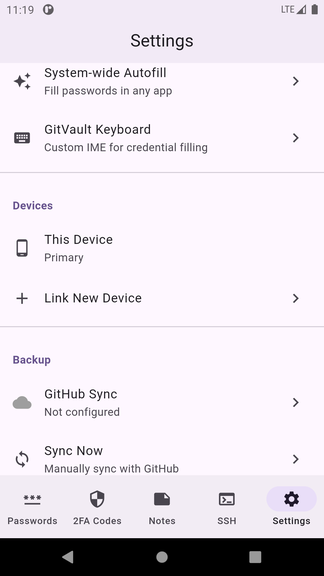<br/><sub><b>Autofill · IME · Devices · Backup</b></sub></td>
    <td align="center">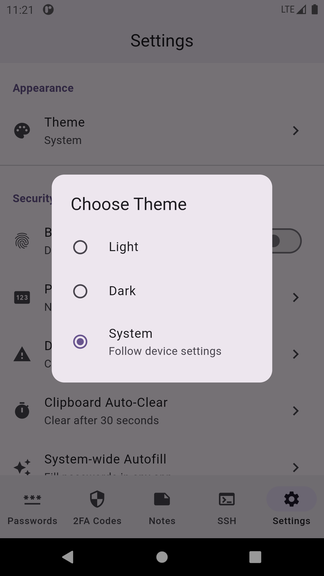<br/><sub><b>Theme Picker</b></sub></td>
    <td align="center">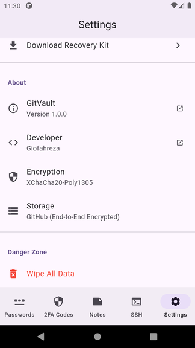<br/><sub><b>About · Encryption Details</b></sub></td>
  </tr>
</table>

- **Theme** — Light, Dark, or follow System setting
- **Biometric authentication** — unlock with fingerprint
- **PIN Lock** — 4–6 digit backup unlock PIN
- **Duress Mode** — emergency panic PIN wipes vault
- **Clipboard Auto-Clear** — erase copied passwords after 10/30/60/120 seconds
- **System-wide Autofill** — fill passwords in any app (Android 8.0+)
- **GitVault Keyboard (IME)** — custom keyboard for credential filling
- **GitHub Sync** — encrypted backup to your private repo
- **Auto-Sync** — configurable background sync interval
- **Device Linking** — link multiple devices via QR code
- **Download Recovery Kit** — export emergency recovery document

---

### 🔒 Security Features
<table>
  <tr>
    <td align="center">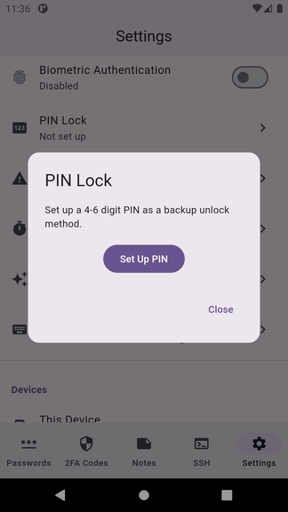<br/><sub><b>PIN Lock Setup</b></sub></td>
    <td align="center">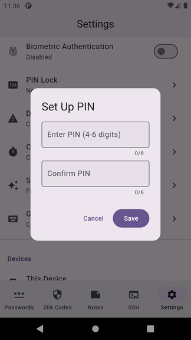<br/><sub><b>PIN Entry</b></sub></td>
    <td align="center">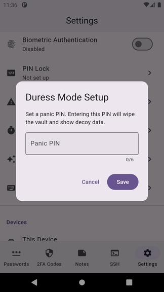<br/><sub><b>Duress Mode (Panic PIN)</b></sub></td>
    <td align="center">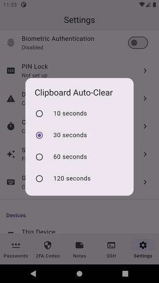<br/><sub><b>Clipboard Auto-Clear</b></sub></td>
  </tr>
</table>

- **XChaCha20-Poly1305 AEAD** — state-of-the-art authenticated encryption
- **On-device key derivation** — master key never leaves the device
- **Zero-knowledge storage** — GitHub only stores opaque encrypted blobs
- **PIN Lock** — 4–6 digit backup unlock
- **Duress Mode** — entering the panic PIN wipes the vault and shows decoy data
- **Clipboard Auto-Clear** — automatically clears sensitive data from clipboard
- **Biometric unlock** — fingerprint authentication via Android BiometricPrompt

---

### ⌨️ Autofill & IME Keyboard
<table>
  <tr>
    <td align="center">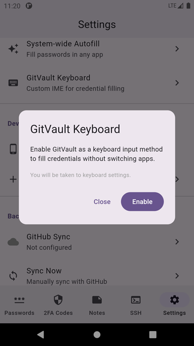<br/><sub><b>GitVault Keyboard Setup</b></sub></td>
    <td align="center"><br/><sub><b>Autofill & IME Settings</b></sub></td>
  </tr>
</table>

- **System-wide autofill** — GitVault appears as autofill provider across all apps
- **GitVault IME** — custom keyboard overlay suggests credentials in-context
- **Inline suggestions** — appears inside keyboard on Android 11+ (Gboard, Samsung Keyboard, SwiftKey)
- **Dropdown fallback** — works on Android 8.0+ even without inline support

---

## Installation

1. Download `app-release.apk` from [Releases](../../releases)
2. Enable "Install from unknown sources" on your Android device
3. Install the APK
4. Follow the onboarding flow

---

## Setup

### 1. Initial Setup

1. Open GitVault → tap **Get Started**
2. Save your **Recovery Kit** (shown on first launch — keep it safe!)
3. Set up optional biometric / PIN unlock

### 2. GitHub Sync Setup

GitVault stores your encrypted vault in a private GitHub repository.

#### Create a GitHub Personal Access Token (PAT):

1. Go to [GitHub → Settings → Developer settings → Fine-grained tokens](https://github.com/settings/personal-access-tokens/new)
2. Set token name: `GitVault`
3. Set Repository access → **Only select repositories** → choose your vault repo
4. Permissions:
   - **Contents**: Read and write
   - **Metadata**: Read (auto-selected)
5. Generate and **copy the token immediately**

#### Configure in GitVault:

1. Settings → **GitHub Sync**
2. Enter your GitHub username and repository name
3. Paste your PAT → tap **Save**

> GitVault uses fine-grained PATs with Bearer authentication — classic tokens are not supported.

### 3. Enable System-wide Autofill

#### Samsung (Galaxy S-series, One UI):
```
Settings → General Management → Passwords, Passkeys, and Autofill
→ Tap cog beside "Preferred Service" → Select GitVault
```

#### Stock Android / Pixel:
```
Settings → System → Languages & input → Autofill service → GitVault
```

#### Verify:
Open Chrome → go to any login page → tap username field → you should see GitVault in the autofill dropdown.

### 4. Enable GitVault Keyboard (IME)

1. Settings → **GitVault Keyboard** → tap **Enable**
2. Follow the system prompt to enable the input method
3. In any text field, switch to GitVault keyboard
4. Credential suggestions appear at the top of the keyboard

---

## Security Notes

| Property | Value |
|----------|-------|
| Encryption | XChaCha20-Poly1305 AEAD |
| Storage | GitHub (ciphertext only) |
| Key derivation | On-device |
| Clipboard TTL | Configurable (10–120 s) |
| Duress PIN | Wipes vault + shows decoy |

All encryption happens **on-device** before any data is sent to GitHub.

---

## Known Issues

### Samsung Devices (One UI 7 / Android 15)

Samsung has a known bug affecting third-party autofill services:
- Samsung Internet may only support Samsung Pass
- Third-party autofill may not appear in settings on some builds

**Workaround**: Use **Google Chrome** instead of Samsung Internet.
See: [One UI 7 autofill issue](https://eu.community.samsung.com/t5/galaxy-s25-series/one-ui-7-android-autofill-password-managers-not-recognising-they/td-p/11632374)

---

## Troubleshooting

### Autofill Not Showing
1. Check GitVault is set as the autofill provider in Android settings
2. Try Chrome instead of Samsung Internet
3. Android 8.0+ required; Android 11+ required for inline suggestions
4. For inline mode, use Gboard, Samsung Keyboard, or SwiftKey

### Sync Issues
| Error | Fix |
|-------|-----|
| Repository not found | Check repo name and PAT permissions |
| Repository empty | Normal for new repos — first save creates it |
| Can't access repository | Check internet connection and PAT expiry |

### Biometric Not Working
Settings → Security → Biometric Authentication → toggle off then on → re-test.

---

## Building from Source

**Prerequisites:** Flutter SDK (stable), Android SDK API 23+, Kotlin 1.9+, Gradle 8.14+

```bash
git clone https://github.com/giofahreza/gitvault
cd gitvault
flutter pub get
cd android && ./gradlew assembleRelease
# Output: build/app/outputs/flutter-apk/app-release.apk
```

---

## Tech Stack

| Layer | Technology |
|-------|-----------|
| Framework | Flutter / Dart |
| Encryption | XChaCha20-Poly1305 (`cryptography` package) |
| Local storage | Hive (encrypted) |
| GitHub API | `github` package for Dart |
| Biometric | `local_auth` |
| QR scanning | `mobile_scanner` |
| Autofill | Android `AutofillService` + `androidx.autofill:1.3.0` |

---

## Contributing

1. Fork the repository
2. Create a feature branch
3. Make your changes
4. Test thoroughly — especially autofill and encryption
5. Submit a pull request

---

## License

MIT License — open source with attribution required.

Copyright (c) 2025 **[Giofahreza](https://github.com/giofahreza)**
Original repository: <https://github.com/giofahreza/gitvault>

You are free to use, fork, modify, and distribute this software. Any fork or
derivative work must visibly credit the original author and link back to the
original repository. See [`LICENSE`](LICENSE) for the full terms.

---

## Credits

- [Flutter](https://flutter.dev)
- [cryptography](https://pub.dev/packages/cryptography) — XChaCha20-Poly1305
- [Hive](https://pub.dev/packages/hive) — local storage
- [KeeVault flutter_autofill_service](https://github.com/kee-org/flutter_autofill_service) — autofill inspiration
- [Bitwarden mobile](https://github.com/bitwarden/mobile) — autofill patterns
- [Android AutofillFramework samples](https://github.com/android/input-samples)
