# GitVault

**A sovereign password manager** — your vault lives in your own private GitHub repository, encrypted end-to-end on device with XChaCha20-Poly1305 before ever leaving your phone.

> No cloud subscriptions. No vendor lock-in. Just your data, your repository, your keys.

---

## Screenshots

<table>
  <tr>
    <td align="center">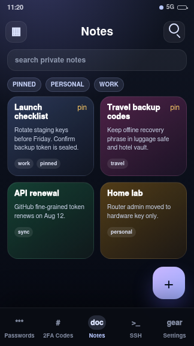<br/><sub><b>Notes · Grid View</b></sub></td>
    <td align="center">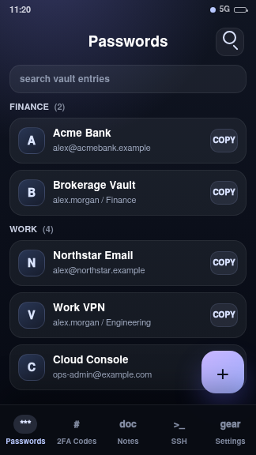<br/><sub><b>Passwords · Grouped List</b></sub></td>
    <td align="center">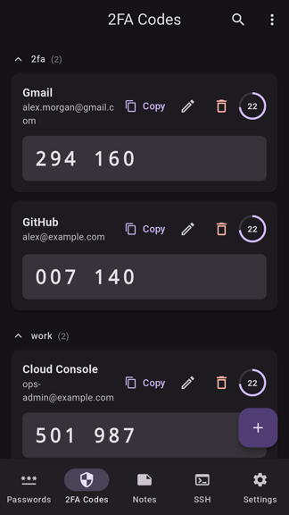<br/><sub><b>2FA Codes · Live TOTP</b></sub></td>
    <td align="center">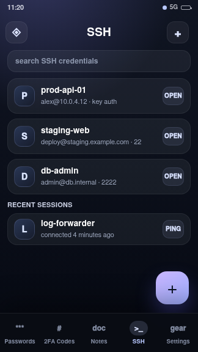<br/><sub><b>SSH · Credentials</b></sub></td>
    <td align="center">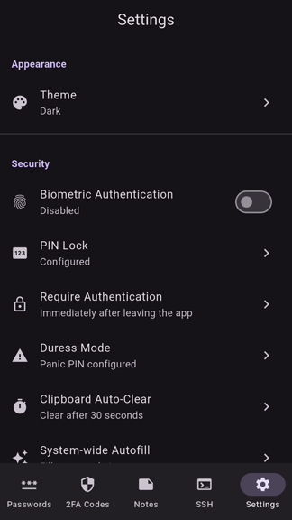<br/><sub><b>Settings</b></sub></td>
  </tr>
</table>

---

## Features

### 📝 Notes
<table>
  <tr>
    <td align="center"><br/><sub><b>Grid View · Pinned Notes</b></sub></td>
    <td align="center">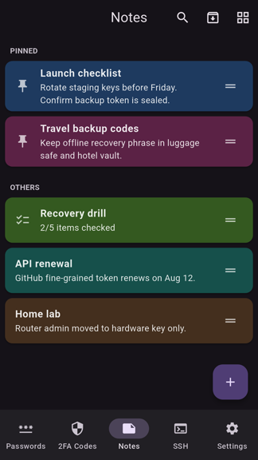<br/><sub><b>List View Toggle</b></sub></td>
    <td align="center">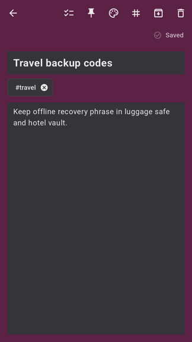<br/><sub><b>Note Editor</b></sub></td>
    <td align="center">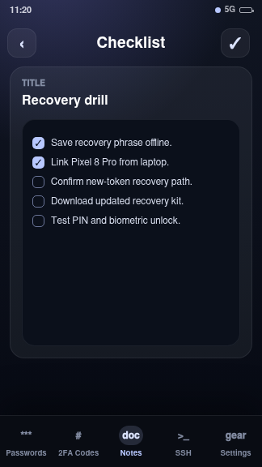<br/><sub><b>Checklist Notes</b></sub></td>
  </tr>
  <tr>
    <td align="center">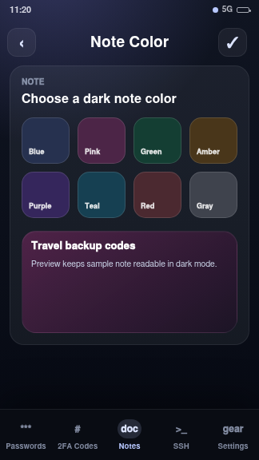<br/><sub><b>Color Picker (11 colors)</b></sub></td>
    <td align="center">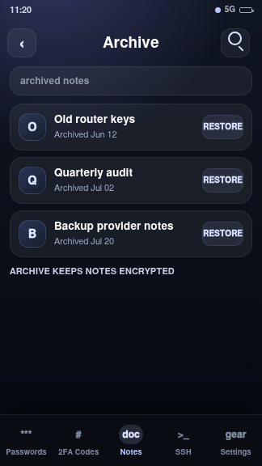<br/><sub><b>Archived Notes</b></sub></td>
    <td align="center">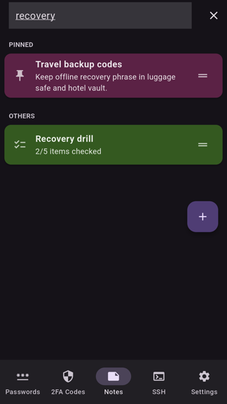<br/><sub><b>Notes Search</b></sub></td>
    <td></td>
  </tr>
</table>

- **Grid & List view** — toggle between masonry cards and compact list
- **Pin notes** — keep important notes always at the top
- **Markdown editor and preview** - headings, lists, task lists, links, code,
  quotes, and tables
- **Knowledge links** - aliases, `[[wiki links]]`, backlinks, unlinked
  mentions, `((block references))`, outlines, and a local knowledge graph
- **Daily notes and templates** - calendar-based journals plus built-in and
  encrypted reusable templates
- **Markdown transfer** - import or export a single decrypted `.md` file with
  structured front matter
- **11 color themes** — white, red, orange, yellow, green, teal, blue, purple, pink, brown, gray
- **Tags** — organize with hashtags (#work, #api, etc.)
- **Archive** — hide notes without deleting them
- **Full-text search** — filter Markdown content, titles, aliases, and tags

---

### Desktop AI Apps (MCP)

GitVault Desktop for Windows, macOS, and Linux can give any
MCP-compatible application explicitly approved access to notes.

- **Notes only** - passwords, TOTP secrets, SSH credentials, GitHub tokens,
  recovery data, and root keys are never exposed through MCP
- **Per-app access** - separate credentials, permissions, tag scopes, and
  write policies for every connected application
- **Desktop-authorized connections** - a connection can be created only by an
  unlocked user pressing **Connect app** in GitVault Desktop; unsolicited
  pairing requests are not accepted
- **Local transports** - authenticated Streamable HTTP on `127.0.0.1` and a
  bundled `gitvault_mcp` stdio bridge
- **Desktop approvals** - inspect create, append, edit, archive, and delete
  requests before allowing them
- **Conflict protection** - stale edits return a conflict instead of
  overwriting a newer note
- **Knowledge-note tools** - AI apps can resolve aliases and blocks, inspect
  outlines and backlinks, work with dated journals, and update one Markdown
  section without replacing the rest of the note
- **Immediate lock and revocation** - locking GitVault blocks note access;
  rotating or revoking a connection invalidates its sessions
- **Redacted local activity** - 30-day history records actions and results,
  never note bodies or credentials

See [AI Apps and MCP](https://gitvault.giofahreza.com/docs/ai-apps/) for setup,
permissions, supported transports, and the local OS-user trust boundary.

---

### 🔐 Passwords
<table>
  <tr>
    <td align="center"><br/><sub><b>Grouped by Category</b></sub></td>
    <td align="center">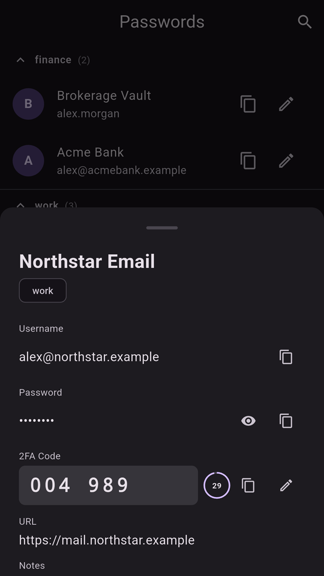<br/><sub><b>Detail + Live TOTP</b></sub></td>
    <td align="center">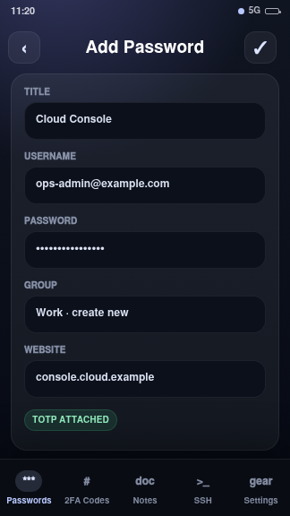<br/><sub><b>Add Password</b></sub></td>
    <td align="center">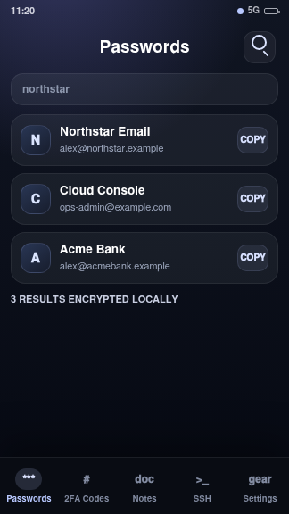<br/><sub><b>Password Search</b></sub></td>
  </tr>
</table>

- **Groups** — organize entries into finance, work, personal, or custom groups
- **Collapsible sections** — expand/collapse groups for quick navigation
- **One-tap copy** — copy username or password without opening the entry
- **URL & notes** — store website URL and free-form notes per entry
- **Live search** — filter across all groups instantly

---

### 🔑 2FA / TOTP Codes
<table>
  <tr>
    <td align="center"><br/><sub><b>Live TOTP Codes with Timer</b></sub></td>
    <td align="center"><br/><sub><b>TOTP in Password Detail</b></sub></td>
  </tr>
</table>

- **Built-in authenticator** — store TOTP secrets alongside passwords
- **Live codes** — 6-digit codes regenerate every 30 seconds
- **Countdown ring** — visual timer shows seconds until next code
- **Dedicated tab** — view all 2FA codes in one place
- **One-tap copy** — copy code before it expires

---

### 🖥️ SSH Terminal
<table>
  <tr>
    <td align="center"><br/><sub><b>SSH Credentials</b></sub></td>
    <td align="center">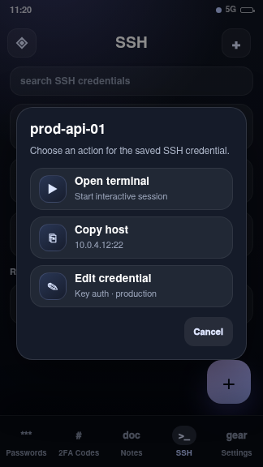<br/><sub><b>Quick Actions Menu</b></sub></td>
    <td align="center">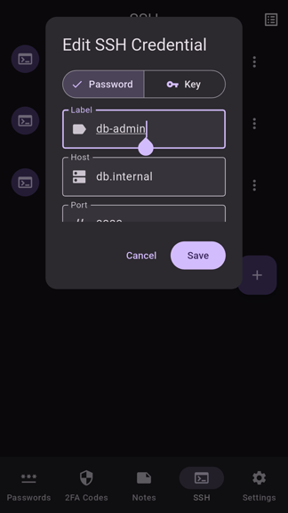<br/><sub><b>Edit Credential (Key Auth)</b></sub></td>
    <td align="center">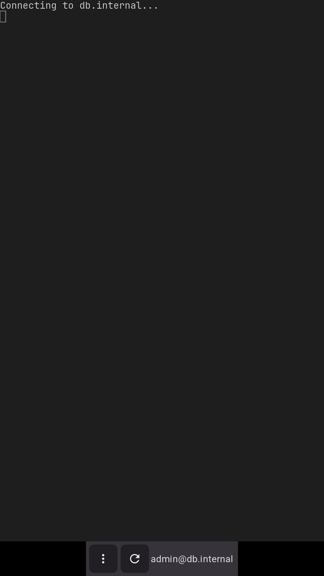<br/><sub><b>Terminal View</b></sub></td>
  </tr>
</table>

- **Password & key authentication** — supports both password and SSH private key auth
- **Custom ports** — connect to any port (not just 22)
- **Ping** — test reachability before connecting
- **Terminal emulator** — full interactive shell with gestures
- **Termux-like gestures** — pinch zoom, double-tap toolbar, long-press context menu
- **Volume key bindings** — Volume Down → Ctrl+C, Volume Up → Ctrl+D
- **Persistent sessions** — sessions survive app closure via background notification

---

### ⚙️ Settings
<table>
  <tr>
    <td align="center"><br/><sub><b>Appearance & Security</b></sub></td>
    <td align="center">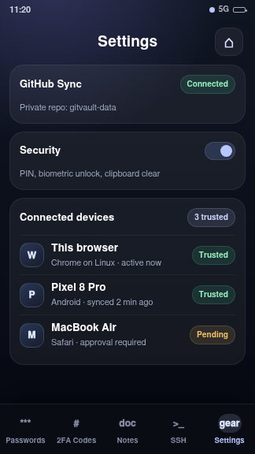<br/><sub><b>Autofill · IME · Devices · Backup</b></sub></td>
    <td align="center">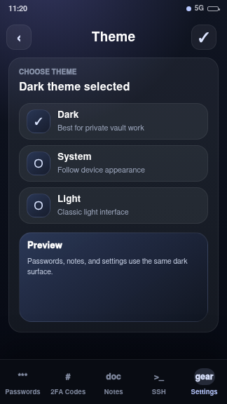<br/><sub><b>Theme Picker</b></sub></td>
    <td align="center">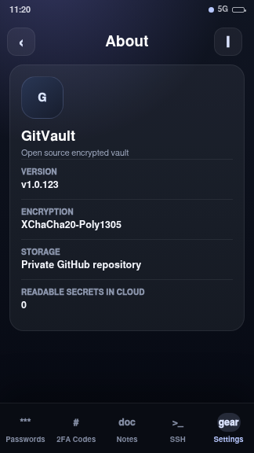<br/><sub><b>About · Encryption Details</b></sub></td>
  </tr>
</table>

- **Theme** — Light, Dark, or follow System setting
- **Biometric authentication** — unlock with fingerprint
- **PIN Lock** — 4–6 digit backup unlock PIN
- **Duress Mode** — emergency panic PIN wipes vault
- **Clipboard Auto-Clear** — erase copied passwords after 10/30/60/120 seconds
- **System-wide Autofill** — fill passwords in any app (Android 8.0+)
- **GitVault Keyboard (IME)** — custom keyboard for credential filling
- **GitHub Sync** — encrypted backup to your private repo
- **Auto-Sync** — configurable background sync interval
- **Device Linking** — link multiple devices via QR code
- **Download Recovery Kit** — export emergency recovery document

---

### 🔒 Security Features
<table>
  <tr>
    <td align="center">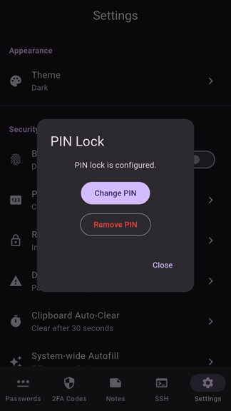<br/><sub><b>PIN Lock Setup</b></sub></td>
    <td align="center">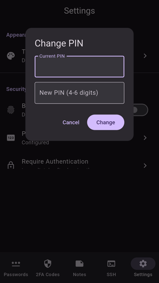<br/><sub><b>PIN Entry</b></sub></td>
    <td align="center">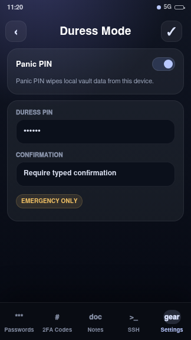<br/><sub><b>Duress Mode (Panic PIN)</b></sub></td>
    <td align="center">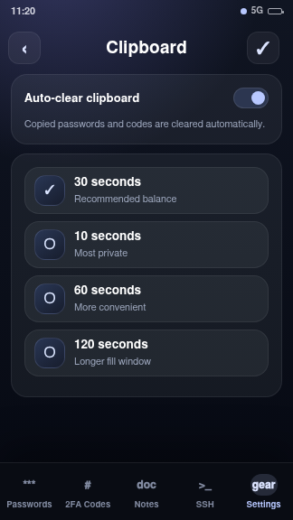<br/><sub><b>Clipboard Auto-Clear</b></sub></td>
  </tr>
</table>

- **XChaCha20-Poly1305 AEAD** — state-of-the-art authenticated encryption
- **On-device key derivation** — master key never leaves the device
- **Zero-knowledge storage** — GitHub only stores opaque encrypted blobs
- **PIN Lock** — 4–6 digit backup unlock
- **Duress Mode** — entering the panic PIN wipes the vault and shows decoy data
- **Clipboard Auto-Clear** — automatically clears sensitive data from clipboard
- **Biometric unlock** — fingerprint authentication via Android BiometricPrompt

---

### ⌨️ Autofill & IME Keyboard
<table>
  <tr>
    <td align="center">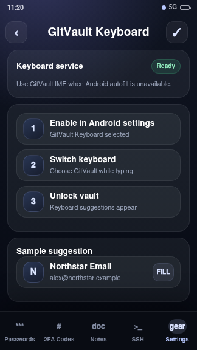<br/><sub><b>GitVault Keyboard Setup</b></sub></td>
    <td align="center"><br/><sub><b>Autofill & IME Settings</b></sub></td>
  </tr>
</table>

- **System-wide autofill** — GitVault appears as autofill provider across all apps
- **GitVault IME** — custom keyboard overlay suggests credentials in-context
- **Inline suggestions** — appears inside keyboard on Android 11+ (Gboard, Samsung Keyboard, SwiftKey)
- **Dropdown fallback** — works on Android 8.0+ even without inline support

---

## Documentation

- [Live Docs](https://gitvault.giofahreza.com/docs/) - multi-page user docs for setup, sync, vault items, devices, recovery, and troubleshooting.
- [Quick Start](https://gitvault.giofahreza.com/docs/quick-start/) - first setup flow for web or Android.
- [Platform Support](https://gitvault.giofahreza.com/docs/platform-support/) - web, Android, and Desktop feature matrix.
- [AI Apps and MCP](https://gitvault.giofahreza.com/docs/ai-apps/) - connect desktop AI applications to scoped notes.
- [GitHub Sync](https://gitvault.giofahreza.com/docs/github-sync/) - private repository and fine-grained token setup.
- [Connected Devices](https://gitvault.giofahreza.com/docs/devices/) - Link New Device, alerts, removal, and trust behavior.
- [Recovery](https://gitvault.giofahreza.com/docs/recovery/) - trusted-device approval and lost-device new-token recovery.
- [Release Verification](https://gitvault.giofahreza.com/docs/release-verification/) - APK and desktop archive checksums plus web version verification.
- [FAQ](https://gitvault.giofahreza.com/docs/faq/) - common setup, sync, recovery, autofill, and release mistakes.
- [Docs Index](docs/README.md) - repository documentation entry point.
- [User Guide](docs/user-guide.md) - single-file setup and recovery reference.
- Web app - available at `https://gitvault.giofahreza.com/app/`.

---

## Installation

### Android

1. Download the latest `gitvault-v*-universal.apk` from [Releases](../../releases)
2. Enable "Install from unknown sources" on your Android device
3. Install the APK
4. Follow the onboarding flow

### Desktop

1. Download the Windows, macOS, or Linux archive from
   [Releases](../../releases).
2. Extract the complete archive so the app and `gitvault_mcp` bridge stay
   together.
3. Open GitVault, unlock the vault, then use **Settings > AI Apps** to enable
   local MCP access.

Unsigned macOS builds can show a Gatekeeper warning. Linux builds require GTK
3, AppIndicator, and Secret Service libraries supplied by the desktop
distribution.

---

## Setup

### 1. Initial Setup

1. Open GitVault → tap **Get Started**
2. Save your **Recovery Kit** (shown on first launch — keep it safe!)
3. Set up optional biometric / PIN unlock

### 2. GitHub Sync Setup

GitVault stores your encrypted vault in a private GitHub repository.

#### Create a GitHub Personal Access Token (PAT):

1. Go to [GitHub → Settings → Developer settings → Fine-grained tokens](https://github.com/settings/personal-access-tokens/new)
2. Set token name: `GitVault`
3. Set Repository access → **Only select repositories** → choose your vault repo
4. Permissions:
   - **Contents**: Read and write
   - **Metadata**: Read (auto-selected)
5. Generate and **copy the token immediately**

#### Configure in GitVault:

1. Settings → **GitHub Sync**
2. Enter your GitHub username and repository name
3. Paste your PAT → tap **Save**

> GitVault uses fine-grained PATs with Bearer authentication — classic tokens are not supported.

### 3. Add or Restore Devices

GitVault has two device flows. Use **Link New Device** when you still have one trusted device. Use **Restore Device** only when you are setting up a device from the recovery phrase.

#### Add a device with Link New Device

Use this when your old phone/browser is still available.

1. On the trusted device, open Settings → **Link New Device**
2. Keep **This Device** selected and show the QR code or copy the transfer code
3. On the new device, open **Link New Device** → **New Device**
4. Scan the QR code or paste the transfer code
5. Enter the 6-digit PIN shown on the trusted device
6. Name the new device

The source device creates a short-lived encrypted invite. The new device is marked trusted only after it consumes that invite.

#### Restore a device with recovery phrase

Use this when installing GitVault on a device that was not linked from another trusted device.

1. Configure GitHub Sync with the existing repository and your current/old GitHub token
2. When GitVault detects existing vault data, choose **Restore with Recovery Phrase**
3. Enter the 24-word recovery phrase
4. GitVault creates a recovery approval request and waits for another trusted device

If another trusted device is available:

1. Open GitVault on that device
2. Go to Settings → Devices
3. Approve the recovery request
4. Return to the new device and wait for approval, or tap **Check Approval**

If all trusted devices are lost:

1. Create a **new** GitHub token for the same vault repository
2. Return to GitVault on the recovering device
3. Tap **Use New Token**
4. Paste the newly generated token
5. After recovery succeeds, revoke the old token in GitHub

This lost-device path requires both the old token and a newly generated token. The old token proves access to the existing vault repository. The new token proves current control of the GitHub account.

### 4. Enable System-wide Autofill

#### Samsung (Galaxy S-series, One UI):
```
Settings → General Management → Passwords, Passkeys, and Autofill
→ Tap cog beside "Preferred Service" → Select GitVault
```

#### Stock Android / Pixel:
```
Settings → System → Languages & input → Autofill service → GitVault
```

#### Verify:
Open Chrome → go to any login page → tap username field → you should see GitVault in the autofill dropdown.

### 5. Enable GitVault Keyboard (IME)

1. Settings → **GitVault Keyboard** → tap **Enable**
2. Follow the system prompt to enable the input method
3. In any text field, switch to GitVault keyboard
4. Credential suggestions appear at the top of the keyboard

---

## Security Notes

| Property | Value |
|----------|-------|
| Encryption | XChaCha20-Poly1305 AEAD |
| Storage | GitHub (ciphertext only) |
| Key derivation | On-device |
| Clipboard TTL | Configurable (10–120 s) |
| Duress PIN | Wipes vault + shows decoy |

All encryption happens **on-device** before any data is sent to GitHub.

---

## Known Issues

### Samsung Devices (One UI 7 / Android 15)

Samsung has a known bug affecting third-party autofill services:
- Samsung Internet may only support Samsung Pass
- Third-party autofill may not appear in settings on some builds

**Workaround**: Use **Google Chrome** instead of Samsung Internet.
See: [One UI 7 autofill issue](https://eu.community.samsung.com/t5/galaxy-s25-series/one-ui-7-android-autofill-password-managers-not-recognising-they/td-p/11632374)

---

## Troubleshooting

### Autofill Not Showing
1. Check GitVault is set as the autofill provider in Android settings
2. Try Chrome instead of Samsung Internet
3. Android 8.0+ required; Android 11+ required for inline suggestions
4. For inline mode, use Gboard, Samsung Keyboard, or SwiftKey

### Sync Issues
| Error | Fix |
|-------|-----|
| Repository not found | Check repo name and PAT permissions |
| Repository empty | Normal for new repos — first save creates it |
| Can't access repository | Check internet connection and PAT expiry |

### Biometric Not Working
Settings → Security → Biometric Authentication → toggle off then on → re-test.

---

## Building from Source

**Prerequisites:** Flutter 3.29.3, Android SDK API 23+, Kotlin 1.9+, Gradle 8.14+

```bash
git clone https://github.com/giofahreza/gitvault
cd gitvault
flutter pub get
flutter test
flutter build apk --release
flutter build linux --release   # or windows / macos on that host OS
dart compile exe bin/gitvault_mcp.dart -o gitvault_mcp
```

---

## Tech Stack

| Layer | Technology |
|-------|-----------|
| Framework | Flutter / Dart |
| Encryption | XChaCha20-Poly1305 (`cryptography` package) |
| Local storage | Hive (encrypted) |
| GitHub API | `github` package for Dart |
| Biometric | `local_auth` |
| QR scanning | `mobile_scanner` |
| Autofill | Android `AutofillService` + `androidx.autofill:1.3.0` |

---

## Contributing

1. Fork the repository
2. Create a feature branch
3. Make your changes
4. Test thoroughly — especially autofill and encryption
5. Submit a pull request

---

## License

MIT License — open source with attribution required.

Copyright (c) 2025 **[Giofahreza](https://github.com/giofahreza)**
Original repository: <https://github.com/giofahreza/gitvault>

You are free to use, fork, modify, and distribute this software. Any fork or
derivative work must visibly credit the original author and link back to the
original repository. See [`LICENSE`](LICENSE) for the full terms.

---

## Credits

- [Flutter](https://flutter.dev)
- [cryptography](https://pub.dev/packages/cryptography) — XChaCha20-Poly1305
- [Hive](https://pub.dev/packages/hive) — local storage
- [KeeVault flutter_autofill_service](https://github.com/kee-org/flutter_autofill_service) — autofill inspiration
- [Bitwarden mobile](https://github.com/bitwarden/mobile) — autofill patterns
- [Android AutofillFramework samples](https://github.com/android/input-samples)
